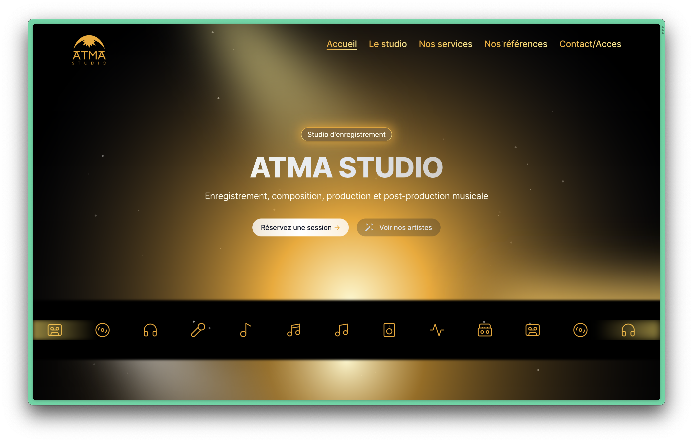

# ATMA STUDIO

Modern music recording studio using React, Next.js, Tailwind CSS, and Sanity. Explore equipment, services, and spaces seamlessly. Perfect for music enthusiasts. 🎶

Deployed on Vercel here : [Atma Studio](https://studio-atma.com)

<p align="center">
<a href=https://github.com/atma-studio/atma-studio target="_blank">

</a>
</p>

## 🔍 Table of Contents

- [ATMA STUDIO](#atma-studio)
  - [🔍 Table of Contents](#-table-of-contents)
  - [💻 Stack](#-stack)
  - [📝 Project Summary](#-project-summary)
  - [🚀 Run Locally](#-run-locally)
  - [⚙️ Setting Up](#️-setting-up)
    - [Your Environment Variable](#your-environment-variable)
  - [🙌 Contributors](#-contributors)
  - [📄 License](#-license)

## 💻 Stack

- [react](https://reactjs.org/): A JavaScript library for building user interfaces.
- [react-dom](https://reactjs.org/docs/react-dom.html): Provides DOM-specific methods that can be used at the top level of your application to enable React features.
- [next](https://nextjs.org/): A framework for React applications that provides server-side rendering, static site generation, and more.
- [tailwindcss](https://tailwindcss.com/): A utility-first CSS framework for rapidly building custom designs.
- [typescript](https://www.typescriptlang.org/): A superset of JavaScript that adds static types to the language.
- [Biome](https://biomejs.dev/): A pluggable and configurable linter/formater tool super fast and easy to use.
- [react-hook-form](https://react-hook-form.com/): A library for managing form state and validation in React.

## 📝 Project Summary

- [**app**](app): Main application directory.
- [**app/(legal)**](app/(legal)): Legal-related functionalities and components.
- [**app/(sanity-studio)**](app/(sanity-studio)): Sanity Studio related functionalities and components.
- [**app/(site)**](app/(site)): Website-related functionalities and components.
- [**app/api**](app/api): API-related functionalities and components.
- [**components**](components): Reusable UI components.
- [**components/emails**](components/emails): Email-related components.
- [**components/ui**](components/ui): UI-related components.
- [**components/utils**](components/utils): Utility components.
- [**sanity**](sanity): Sanity CMS related functionalities and components.

## 🚀 Run Locally

1.Clone the atma-studio repository:

```sh
git clone https://github.com/atma-studio/atma-studio
```

2.Install the dependencies with one of the package managers listed below:

```bash
pnpm install
bun install
npm install
yarn install
```

3.Start the development mode:

```bash
pnpm run dev
bun run dev
npm run run dev
yarn run dev
```

## ⚙️ Setting Up

#### Your Environment Variable

- Step 1 :

    Create a `.env.local`

- Step 2 :
  
    Copy paste this env varibales :

```env
NEXT_PUBLIC_GOOGLE_MAPS_API_KEY=
NEXT_PUBLIC_SANITY_PROJECT_ID=
NEXT_PUBLIC_SANITY_DATASET=production
SANITY_API_READ_TOKEN=
RESEND_API_KEY=
NEXT_PUBLIC_GOOGLE_ADS_ID=
NEXT_PUBLIC_MAP_ID=
```

## 🙌 Contributors

<table style="border:1px solid #404040;text-align:center;width:100%">
<tr><td style="width:14.29%;border:1px solid #404040;">
        <a href="https://github.com/ErwannRousseau" spellcheck="false">
          
          <br />
          <b>ErwannRousseau</b>
        </a>
        <br />
        <a href="https://github.com/atma-studio/atma-studio/commits?author=ErwannRousseau" title="Contributions" spellcheck="false">
          122 contributions
        </a>
      </td></table>

## 📄 License

All right reserved [ATMA Studio](https://studio-atma.com)
